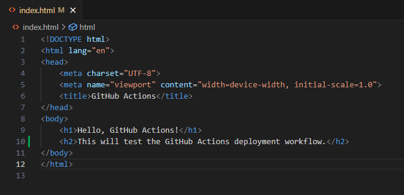

# GitHub Actions Project

This project demonstrates a simple GitHub Actions workflow. The workflow only fires when changes are made to files in the "github-pages-deployment" folder.

## Prerequisites

1. A GitHub repository.
2. Basic understanding of GitHub Actions

## Steps to Run

1. **Clone the Repository**
```bash
    git clone https://github.com/w-menezes/devops-projects.git
    cd devops-projects\github-pages-deployment
```
2. **Configure GitHub Pages**
- In the repository's settings, navigate to **Pages**
- Set the **Source** to GitHub Actions
- A new .yml file is created in .github/workflows

3. **Make a Change to index.html**



4. **Push Changes to GitHub**

```bash
    git add .
    git commit -m "Added a test line to webpage"
    git push origin main
```

5. **Validate Webpage Updated**
- go to your [Pages site](https://w-menezes.github.io/devops-projects/github-pages-deployment/)